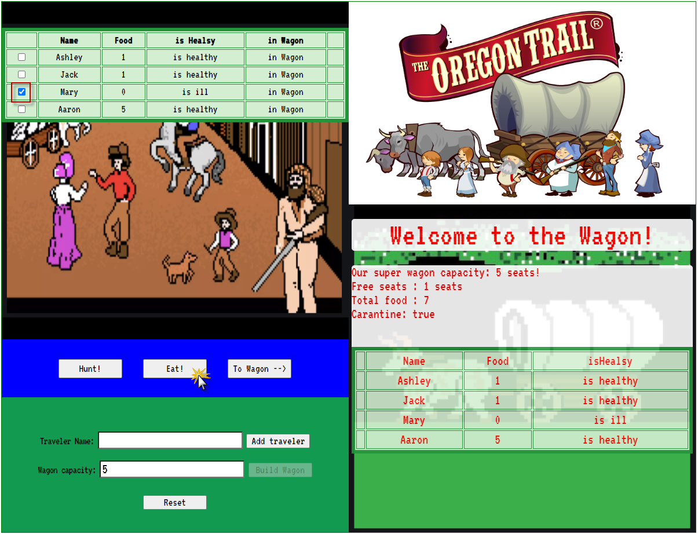

## By the path of Oregon Trail. [Use classes assessment]
link:  https://ev-ran.github.io/By-Oregon-Trail/
 

## Actions 

 * Add traveler . 
 *  Add Wagon (set the Wagon capacity).
 * Create table with Travelers
 * Add choosen travelers to Wagon
 * Create synchronized table with Passengers (travelers in this Wagon)
 * Action Hunt - for choosen Traveler
 * Action Eat - for choosen Traveler
 *  Display:
**  Wagon capacity
** Number of free seats in Wagon
** Total Food in Wagon
** Carantine - in Wagon
